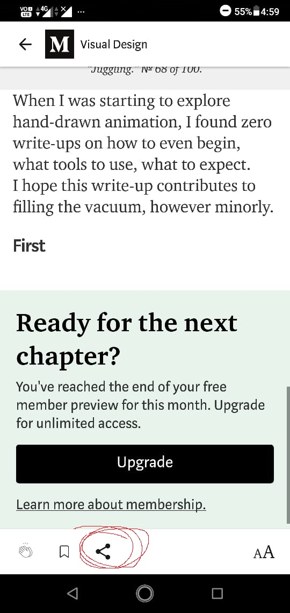
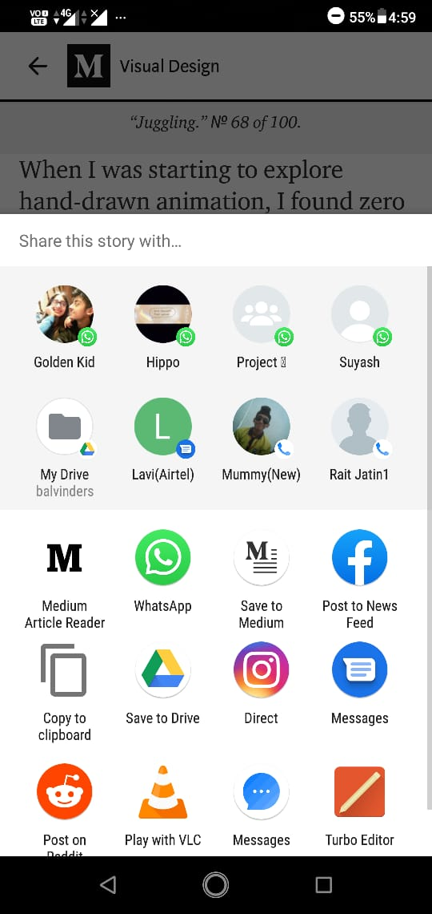
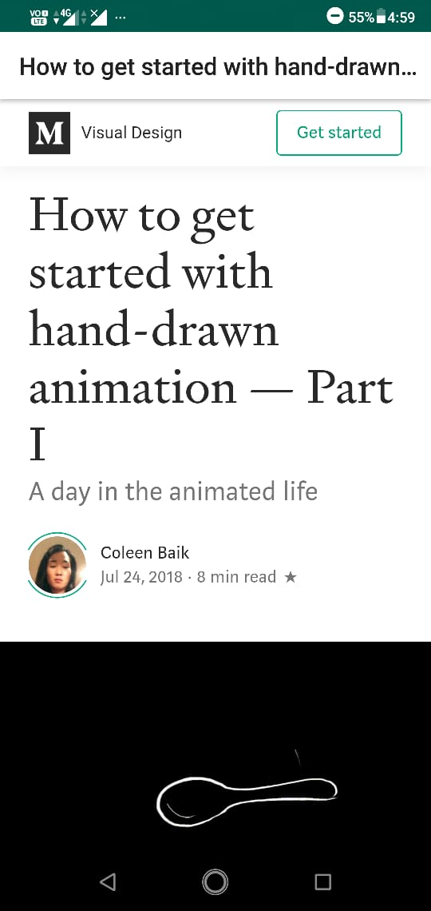

  <h2 align="center">Medium Article Reader</h2>
  
Read Premium Articles for free

  

    
  

<h2>Steps</h2>

1. Download Medium app from playstore.

<a href="https://play.google.com/store/apps/details?id=com.medium.reader&hl=en_IN">Download Medium</a>

2. Open Medium App

3.Select any premium article 

  
4.Click on Share button 

    
    
5. Select Medium Article reader

    
    
6. Read

  

#### >>>>>[CLICK TO DOWNLOAD THE APP](https://github.com/JATIN2111999/Medium-Article-Reader/blob/master/app/release/app-release.apk?raw=true)<<<<<

